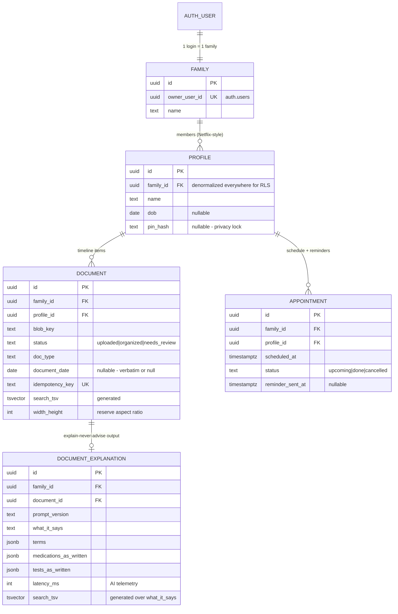
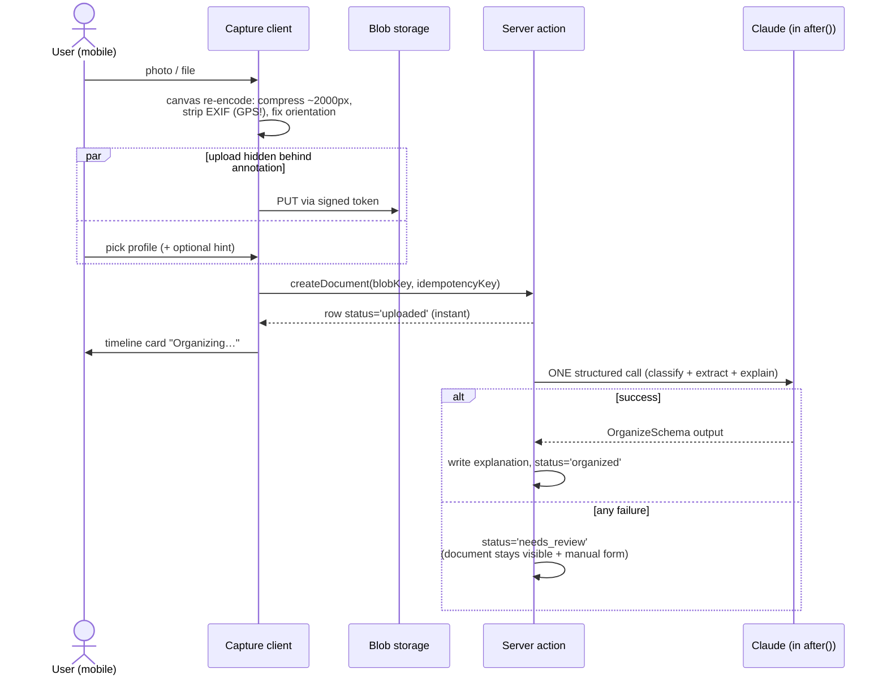
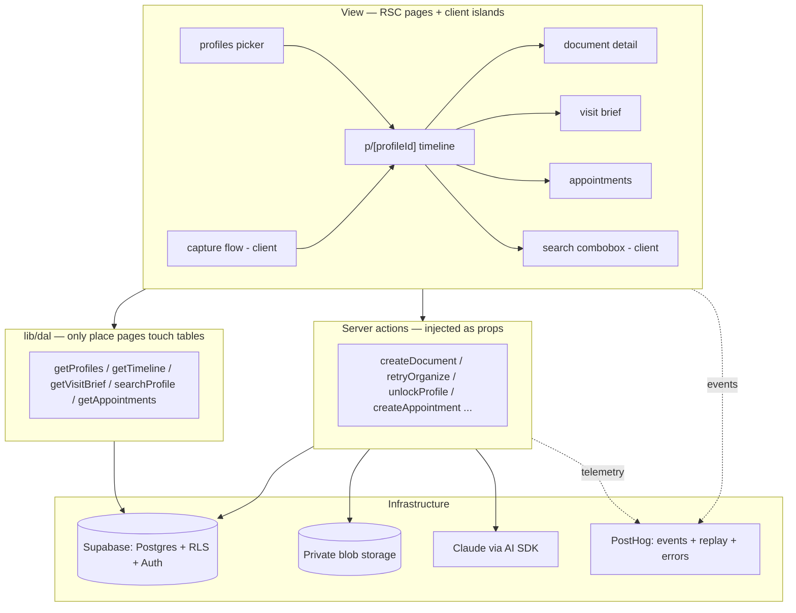
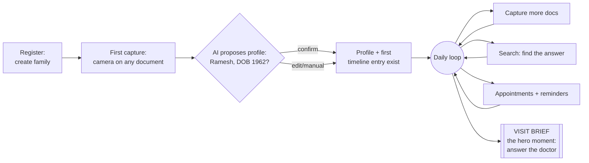

# CareAlign v2 — System Design (RADIO)

> The greenfield design for the product defined in `docs/analysis/05-direction.md`. Structured as Requirements → Architecture → Data model → Interface → Optimizations.
> Terminology is final and role-free: **family, profile, document, explanation, appointment.** The words "coordinator" and "patient" do not appear in v2 code.

---

## R — Requirements

### Core journeys (V1, confirmed)

1. **Capture:** photograph or upload a medical document into a family member's timeline in under 10 seconds of user effort, with zero data loss even on flaky clinic networks.
2. **Retrieve:** in front of a doctor, answer "any history / what medications / when was that test?" — via per-profile search and a one-tap **visit brief**.
3. **Stay in the loop:** per-profile appointments with reminders.
4. **Family model:** one account = one family (shared login); members are profiles; optional per-profile PIN lock; no roles.

### Non-functional requirements

- **AI boundary (Hard Rule):** explain, never advise. The system may state what a document factually says and define terms. It never interprets severity, recommends actions, or compares to norms. Every AI-derived statement is traceable to a source document ("as written in…").
- **Mobile-first.** The capture and retrieval moments happen standing in hospitals and clinics.
- **Family scale, honestly:** ≤ ~10 profiles, thousands (not millions) of documents per family. Every architecture choice below is sized to this — hyperscale patterns are adopted only where they cost nothing or prevent data corruption.
- **Capture is sacred:** a selected photo must never be silently lost — uploaded bytes always produce a visible timeline entry, even when AI organization fails.
- **DPDP posture:** health data of family members under the household's own custody ("pre-existing exposure" model); private blob storage; no third-party sharing surface in V1.

### Performance & accessibility targets

Numbers, not adjectives — so a later check has something to pass or fail against. Measured against a mid-range Android phone on Indian 4G (the real usage profile, not a US-region CI runner), via PostHog's real-user monitoring (D-007) rather than a synthetic benchmark.

- **Core Web Vitals (Google's page-speed metrics), p75:** Largest Contentful Paint (time to the biggest visible element) < 2.5s · Interaction to Next Paint (tap-to-response time) < 200ms · Cumulative Layout Shift (how much content jumps around while loading) < 0.1.
- **Accessibility standard:** WCAG (Web Content Accessibility Guidelines) 2.2, level AA, as the floor for every shipped screen.
- **Touch targets:** minimum 44×44px on any tappable element (exceeds WCAG AA's 24px minimum — deliberate, for one-handed use in a clinic corridor).
- **Reflow:** every screen usable at 320px width and 200% browser zoom without horizontal scrolling.

### Explicitly out of V1

Hospital/insurer discovery (V2), sharing outside the family account, insurance claims, regional languages, anything advisory, offline-first sync, push notifications beyond appointment reminders.

---

## A — Architecture

### Stack (carried forward)

Next.js 16 App Router + React 19 + TypeScript · Supabase (Postgres/Auth/RLS + Storage private bucket, D-003) · Claude via AI SDK v6 (`generateText + Output.object`) · Shadcn/Tailwind v4 · Upstash rate limiting · Vercel deploy.

### Route tree (one tree, no role branches)

```
app/
  (auth)/login, (auth)/register        ← register = create the family account
  (app)/
    profiles/                          ← Netflix-style profile picker + manage/add/lock
    p/[profileId]/                     ← timeline (default view) + capture entry point
    p/[profileId]/brief                ← visit brief (print/share-friendly screen)
    p/[profileId]/appointments
    p/[profileId]/search               ← retrieval surface (also reachable from timeline header)
  api/documents/[documentId]/file      ← auth-checked 302 to short-lived Supabase Storage signed URL
proxy.ts                               ← session refresh + auth redirects only
```

Rendering: RSC pages fetching through a DAL (v1 discipline carried over), client islands only where interaction demands it (capture flow, search box, PIN unlock, appointment form). No global client store in V1 — at family scale, server components + targeted `revalidatePath` beat a normalized store; the News-Feed store pattern is consciously deferred (see O).

### The capture pipeline (the centerpiece — adapted from the Photo Sharing extract)

The core insight adopted: **separate media upload from record creation, and hide upload latency behind the user's own annotation time.**

```
1. Select/camera  → client-side downscale + compress (canvas → WebP/JPEG,
                    longest edge ~2000px: enough for AI OCR, ~10x smaller upload).
                    The canvas re-encode also STRIPS EXIF (GPS coords + device IDs
                    must never reach storage — these are medical photos) and applies
                    the EXIF orientation flag so iOS portraits don't render sideways.
2. Immediately    → client upload direct to the private Supabase Storage bucket
                    via createSignedUploadUrl token (bytes never transit our
                    server; D-003), IN PARALLEL with…
3. …the user picking: which profile, optional type hint, optional note
4. Submit         → createDocument server action: small JSON call with blob key +
                    client-generated idempotency_key → row status='uploaded' →
                    responds immediately; timeline shows the document card ("Organizing…")
5. Background     → Next.js after(): ONE structured AI call (classify + extract +
                    explain combined) → status='organized', card fills in
6. AI failure     → status='needs_review': document stays fully visible in the
                    timeline with its image and a manual-details form. Never deleted,
                    never hidden, never blocks the user.
```

Design deltas vs. CareAlign v1, deliberately: **one** AI call instead of a blocking three-call chain (upload previously stalled the UI through classify → translate → summarise); AI runs **after the response** (`after()`), so capture feels instant; failure is a *reviewable state*, not a dead `failed` status.

### Onboarding: the first capture IS the onboarding (invisible-agent pattern)

No forms-first cold start. After registration the user is taken straight to capture: photograph any medical document, and the same organization call that extracts doctor/date/details also extracts the patient's name (and DOB when printed) and **proposes the profile** — "This looks like a prescription for Ramesh, DOB 1962 — create his profile?" One confirmation creates the first profile *and* its first timeline entry. The agent does the data entry; the user only confirms. (Adapted from YC RFS "Dynamic Software Interfaces" — the agent is invisible in the flow; profile forms remain available as the manual path.) `OrganizeSchema` therefore includes `patient_name_as_written?` and `patient_dob_as_written?`.

### AI organization step

- Single `OrganizeSchema` output: `{ doc_type, title, title_is_guessed, document_date?, doctor_name?, facility_name?, what_it_says, terms[{term, meaning}], medications_as_written[], tests_as_written[{name, value, unit}] }`.
- All extraction is **verbatim-or-null** (v1's "Date unknown / never fabricate" rule carries over; `?` fields stay null when not printed on the document).
- `what_it_says` and `terms` are the explain-never-advise surface — prompt hard-constrained to description and definition; no severity, no advice, no norm comparison. This constraint is enforced in the prompt AND stated in the schema field descriptions.
- Model map salvaged from v1 (`AI_MODELS` tier pattern); prompt_version stored on every explanation row for re-runs.

---

## D — Data model

```
auth.users (Supabase; ONE user = one family login)
  └─► families (id, owner_user_id UNIQUE → auth.users, name)
        └─► profiles (id, family_id, name, dob?, sex?, color, pin_hash?)   ← family members; NOT auth users
              ├─► documents (id, family_id, profile_id, blob_key, mime_type, byte_size,
              │              width?, height?, status: uploaded|organized|needs_review,
              │              doc_type, title, title_is_guessed, document_date?,
              │              doctor_name?, facility_name?, idempotency_key UNIQUE,
              │              search_tsv GENERATED, captured_at)
              │     └─► document_explanations (id, family_id, document_id, prompt_version,
              │                                what_it_says, terms jsonb,
              │                                medications_as_written jsonb, tests_as_written jsonb)
              └─► appointments (id, family_id, profile_id, title, doctor_name?, facility?,
                                scheduled_at, notes?, status: upcoming|done|cancelled,
                                reminder_sent_at?)
```

Key decisions:

- **`family_id` is denormalized onto every table.** RLS policies then never join: `family_id = current_family_id()` where `current_family_id()` is a `security definer` helper resolving `auth.uid() → families.id` (cached per request). This follows Supabase's RLS-performance guidance and eliminates v1's most confusing query paths.
- **Two-layer discipline (v1's hardest-won lesson):** every migration that creates a table includes both the RLS policies AND `GRANT SELECT, INSERT, UPDATE, DELETE … TO authenticated; GRANT ALL … TO service_role;`. The silent 0-row-update failure mode is documented in the migration template itself.
- **`documents.width/height` stored at upload** (Photo Sharing extract): timeline reserves aspect-ratio boxes → no layout shift in an image-heavy list.
- **`idempotency_key`** (News Feed extract): client-generated at submit time, unique-constrained — an upload retry can never create a duplicate timeline entry.
- **Search:** two generated `tsvector` columns (a GENERATED column cannot reference another table): `documents.search_tsv` over title/doctor/facility/doc_type and `document_explanations.search_tsv` over `what_it_says` — both GIN-indexed, queried together, plus `pg_trgm` on titles for fuzzy matches; always filtered by profile. pgvector/semantic is deferred.
- **Timeline** = keyset-paginated union of documents and appointments per profile, ordered by event date (`document_date ?? captured_at`-day-in-IST — D-011, `scheduled_at`), cursor = `(event_date, id)`. Enum-like columns are text + CHECK, not Postgres enums (D-010).
- **Profile PIN** = bcrypt `pin_hash`; unlock is a server action setting a short-lived signed cookie scoped to that profile. Honest threat model, documented: the PIN protects *privacy within the family*, not security against whoever holds the account password — RLS cannot distinguish family members because there is only one auth user. **Changing or removing an existing PIN requires proof of scope** (Netflix profile-lock model): the profile-holder proves it with the current PIN; the account-holder proves it by re-entering the account password (also the forgotten-PIN recovery path — without it a forgotten PIN would lock the family out of those records forever). First-time set is open to any session: no PIN exists to prove profile-holder-ship against, and a bad-faith set is recoverable via the password path.
- **Visit brief** = read-time aggregation, no table: profile header + medications-as-written from recent prescriptions (each item cited to its source document) + latest document per type + recent/upcoming appointments. Factual, cited, printable.
- **No episodes, no tasks, no access grants, no provenance, no invites.** Gone with the role model.

## I — Interface

**Server actions** (injected into client components as props — v1 Hard Rule 11 carries over):
`registerFamily`, `addProfile`, `updateProfile`, `setProfilePin` (first set only), `changeProfilePin` / `removeProfilePin` (require current PIN or account password), `unlockProfile`, `requestUploadToken`, `createDocument`, `retryOrganize`, `updateDocumentDetails` (manual correction for `needs_review` and user fixes), `deleteDocument`, `createAppointment`, `updateAppointment`, `searchDocuments`.

**DAL** (`lib/dal/` — the only place pages/layouts touch tables; v1 Hard Rule 12):
`getFamily`, `getProfiles`, `getTimeline(profileId, cursor?)`, `getDocument`, `searchProfile(profileId, q)`, `getVisitBrief(profileId)`, `getAppointments(profileId)`, `getDueReminders` (cron).

**Reminders (the one new infra piece):** Vercel Cron → route scans `appointments` where `scheduled_at` is near and `reminder_sent_at IS NULL` → email to the family account address (Resend) + in-app upcoming surface. Web push deferred.

**Search UX contract** (Autocomplete extract): 300ms debounce, `minQueryLength: 2`, responses keyed to the issuing query string (never trust arrival order), results cached per query for the session, ARIA combobox pattern, ≥44px touch targets, `autocorrect/autocapitalize/spellcheck` off.

**Enforcement carried over wholesale:** `pnpm lint:arch` (tsc + custom ESLint rules + story checks), DAL boundary rule, no-client-action-import rule, domain-types-in-one-file rule, AI SDK deprecated-API rule, design-token rule (with `brand`/`patient` namespaces renamed to role-free names), `.githooks` pre-commit, layer-grouped commits, phase exit gates.

## O — Optimizations

**Adopted in V1** (cheap now, expensive to retrofit):
- Idempotency keys on document creation (News Feed) — prevents duplicates, enables safe retry.
- Parallel presigned upload during annotation (Photo Sharing) — hides latency where it matters most.
- Client-side compression before upload — 10x smaller uploads on hospital Wi-Fi, faster AI reads.
- Stored image dimensions → zero CLS timeline (Photo Sharing).
- `after()`-backgrounded AI with visible `needs_review` fallback — capture never blocks, never loses.
- Debounced, query-keyed, cached search (Autocomplete).
- Simple capture retry: failed blob uploads keep the local file in component state with a retry button (the Email-Client durable-outbox pattern, minimally applied). Retry policy: exponential backoff + jitter, capped attempts, never retry 4xx (400/401/403/404/422).
- Skeleton placeholders (layout-reserving), not spinners, for timeline and search loading states.
- Defensive rendering of AI-derived text: output-encoding only (never `dangerouslySetInnerHTML`), URL-scheme allowlist if anything is ever linkified, restrictive CSP.
- Search delight (cheap): empty-query state shows the profile's recent documents; `/` keyboard shortcut focuses search; `enterkeyhint="search"` on mobile.

**Consciously deferred** (documented so they're decisions, not omissions):
- List virtualization and IndexedDB offline store (News Feed / Email Client) — wrong scale for a family timeline; revisit if a timeline exceeds ~1,000 rendered items.
- Normalized global client store — RSC + revalidation suffices at V1 interaction density.
- pgvector semantic retrieval — FTS+trgm first; add embeddings when real retrieval misses are observed.
- **Natural-language ask (V1.5, schema-ready):** "when was Amma's last HbA1c?" answered by retrieval-with-citations — non-advisory (retrieves and cites, never judges). `tests_as_written`/`medications_as_written` are structured now precisely so this needs no migration later.
- **Landing page (roadmap, post-core-V1):** hero = the visit moment ("Always have the answer when the doctor asks"), 3-step how-it-works (capture → timeline → visit brief), trust block stating the privacy posture and "explains, never diagnoses" as an explicit promise. v1's missing-landing gap must not repeat.
- Web push, WhatsApp reminders, regional languages, discovery (V2+).
- Data Table extract's declarative-columns pattern — parked for the visit brief's medication/test lists if they outgrow simple lists.

---

## Diagrams (living — updated in the same commit as any change to what they depict; see PRACTICES.md §3)

### Database ER



### Capture pipeline (sequence)



### Frontend layers



### Core user flow



## Repo strategy (rework vs. fresh — analysis)

**Recommendation: stay in this repo; tear down the app layer; keep the chassis.** Measured:

- **Keep (the chassis, ~zero-cost to reuse, expensive to recreate):** all config (Next 16/TS/Tailwind v4/Shadcn/Storybook), the 593-line custom ESLint enforcement stack + check-stories + `.githooks`, 14 `components/ui` primitives, `lib/supabase` clients, logger, ratelimit, blob-serving pattern, AI SDK patterns, and the entire `docs/` knowledge base (analysis, anti-patterns, extracts). Recreating this in a fresh repo means re-scaffolding and re-deriving ~all of it, with version-drift risk — pure token/time waste.
- **Delete (the 99-file app layer):** `app/`, `actions/`, `components/features|composites`, `lib/dal`, old migrations. One commit.
- **Reset data:** new Supabase project (schema is incompatible and old data is dev-only) → single fresh baseline migration.
- **Archive:** stale product docs (SPEC, ARCHITECTURE, DATA_MODEL, etc.) → `docs/archive/carealign-v1/`; CLAUDE.md/AGENTS.md rewritten for v2 rules.
- **Name:** product stays **CareAlign**; stale coordinator/patient naming dies with the deleted layer; token namespaces renamed in the one place they're defined.

Net: a fresh repo saves nothing and costs the chassis. In-repo teardown is one deletion commit + one docs commit, and git history (including the v1 record) stays intact.
